---
title: "Indice do SDD"
description: "Indice geral de navegacao da documentacao do projeto"
status: "concluido"
---

# Índice do Software Design Document — Hermes + Obsidian

> **Índice geral de navegação da documentação do projeto.**
>
> **Legenda:** ✅ concluído | 🆕 novo

---

## Métricas do Projeto

| Métrica                            | Valor             |
| ---------------------------------- | ----------------- |
| **Documentos** | 49 |
| **Requisitos Funcionais**          | 38 (11 módulos)   |
| **Requisitos Não Funcionais**      | 23 (7 categorias) |
| **Casos de Uso**                   | 10                |
| **Decisões de Arquitetura (ADRs)** | 15                |
| **Componentes do Sistema**         | 13                |
| **Riscos Mapeados**                | 11 (4 categorias) |
| **Objetivos Específicos**          | 7                 |
| **Agentes de IA** | 5             |
| **Diagramas Mermaid**              | 15                |
| **Total de Linhas**                | ~11.200            |
| **Skills do Hermes (prompts)**      | 14                |
| **Palavras (estimado)**            | ~125.000           |

---

## Mapa de Conexões dos Documentos

```mermaid
graph TD
    classDef fund fill:#e1f5fe
    classDef req fill:#fff3e0
    classDef comp fill:#f3e5f5
    classDef arq fill:#e8f5e9
    classDef dados fill:#fce4ec
    classDef plan fill:#fff8e1
    classDef enri fill:#e0f2f1

    G["Glossário"]:::fund
    V["Visão Geral"]:::fund
    O["Objetivos"]:::fund
    P["Personas"]:::fund
    RF["Requisitos Funcionais"]:::req
    RN["Requisitos Não Funcionais"]:::req
    UC["Casos de Uso"]:::req
    FX["Fluxos"]:::comp
    RS["Riscos"]:::comp
    AD["ADRs"]:::arq
    AQ["Arquitetura"]:::arq
    CP["Componentes"]:::arq
    CF["Configuração"]:::arq
    OP["Operação"]:::arq
    IN["Integrações"]:::arq
    SG["Segurança"]:::arq
    PV["Privacidade"]:::arq
    AG["Agentes"]:::arq
    BD["Banco de Dados"]:::dados
    MO["Memória Obsidian"]:::dados
    MV["MVP"]:::plan
    BL["Backlog"]:::plan
    RD["Roadmap"]:::plan
    EF["Evolução Futura"]:::plan
    CK["Checklist MVP"]:::plan
    ST["Setup"]:::enri
    MR["Matriz Rastreab."]:::enri
    DP["Decisões Pend."]:::enri
    CV["Convenções"]:::enri
    GI["Glossário Ilustrado"]:::enri

    O --> RF
    O --> RN
    P --> UC
    G --> UC
    RF --> UC
    RN --> UC
    UC --> FX
    FX --> RS
    RS --> AD
    AD --> AQ
    AD --> CP
    AD --> CF
    AD --> OP
    AD --> IN
    AD --> SG
    AD --> AG
    AG --> MO
    CP --> MO
    IN --> MO
    BD --> MO
    SG --> PV
    BD --> SG
    BD --> PV
    RF --> MV
    MV --> BL
    BL --> RD
    RD --> EF
    MV --> CK
    AQ --> CV
    OP --> CV
    CF --> ST
    OP --> ST
    AD --> MR
    RF --> MR
    UC --> MR
    FX --> MR
    MO --> GI
    AQ --> GI
    CP --> GI
```

---

## Navegação Rápida

| Tipo | Documentos |
|------|-----------|
| **Fundação** | 1-4: Glossário, Visão, Objetivos, Personas |
| **Requisitos** | 5-7: RFs, RNFs, Casos de Uso |
| **Comportamento** | 8-9: Fluxos, Riscos |
| **Arquitetura** | 10-19: ADRs, Arquitetura, Componentes, Config, Operação, Integrações, Movidesk-API, Segurança, Privacidade, Agentes |
| **Dados** | 20-21: Banco de Dados, Memória Obsidian |
| **Planejamento** | 22-26: MVP, Backlog, Roadmap, Evolução, Checklist |
| **Enriquecimento** | 27-32: Setup, Matriz, Decisões, Convenções, Glossário Ilustrado, Estrutura Projeto |
| **Testes** | 33-45: Estratégia, Plano, Validação, Checklist, Simulação, Falhas, Critérios, Gates, Rollback, Limites, Métricas, Dados, Mocks |
| **Orquestração (Hermes)** | 46-49: Constituição, Skills, Ref Rápida, Bootstrap |

**Leitura recomendada:**
- **Primeiros passos:** Glossário > Visão Geral > Objetivos > Personas
- **Implementação:** ADRs > Arquitetura > Componentes > Operação > Configuração
- **Planejamento:** MVP > Backlog > Roadmap > Checklist MVP
- **Visão completa do dado:** Banco de Dados > Memória Obsidian
- **Testes e validação:** Estratégia > Plano > Validação Loop > Simulação > Mocks
- **Orquestração (Hermes):** Bootstrap (primeiro comando) > Skills (prompts) > Constituição (workflow) > Logs (handover)

---

## Fase 1 — Fundação

| # | Documento | Destaques | Status |
|---|-----------|-----------|--------|
| 1 | [[01-Fundacao/Glossario.md\|Glossário]] | 25+ termos, 5 categorias (Domínio, Status OS, Componentes, Ações, Dados) | concluído |
| 2 | [[01-Fundacao/Visao-Geral.md\|Visão Geral]] | Propósito, Contexto atual, O que faz, Tecnologias, Público, Critérios | concluído |
| 3 | [[01-Fundacao/Objetivos.md\|Objetivos]] | 1 Objetivo Geral, 7 OE, 4 ONFs com métricas | concluído |
| 4 | [[01-Fundacao/Personas.md\|Personas]] | 3 personas (Supervisor, Técnico, Cliente), Cenários, Matriz vs Funcionalidades | concluído |

## Fase 2 — Requisitos

| # | Documento | Destaques | Status |
|---|-----------|-----------|--------|
| 5 | [[02-Requisitos/Requisitos-Funcionais.md\|Requisitos Funcionais]] | 38 RFs, 11 módulos (ACOMP, AUDIO, TRANS, MEM, OS, EMAIL, IA, CONSULTA, SEG, INT, UI) | concluído |
| 6 | [[02-Requisitos/Requisitos-Nao-Funcionais.md\|Requisitos Não Funcionais]] | 23 RNFs, 7 categorias (DES, DISP, SEG, PRIV, USA, MAN, PORT), Matriz de prioridades | concluído |
| 7 | [[02-Requisitos/Casos-de-Uso.md\|Casos de Uso]] | 10 UCs (UC-001 a UC-010), 4 atores, Fluxo principal + alternativos + regras de negócio | concluído |

## Fase 3 — Comportamento & Riscos

| # | Documento | Destaques | Status |
|---|-----------|-----------|--------|
| 8 | [[03-Comportamento/Fluxos.md\|Fluxos]] | 7 fluxos (Macro, Gravação, Registro, Fechamento OS, E-mail, Consulta, Aprovações), 7 diagramas Mermaid | concluído |
| 9 | [[03-Comportamento/Riscos.md\|Riscos]] | 11 riscos (6 técnicos, 3 segurança, 2 projeto, 1 negócio), Matriz com ADRs vinculadas | concluído |

## Fase 4 — Arquitetura & Componentes

| # | Documento | Destaques | Status |
|---|-----------|-----------|--------|
| 10 | [[04-Arquitetura/ADRs.md\|Decisões de Arquitetura (ADRs)]] | 15 ADRs (ADR-001 a 015), Cada uma com Contexto, Opções, Decisão, Vantagens, Desvantagens | concluído |
| 11 | [[04-Arquitetura/Arquitetura.md\|Arquitetura Geral]] | Hexagonal (Ports & Adapters), Processos, Máquina de estados, Concorrência async, Startup/Shutdown, Hierarquia de erros, Logging, Stack, Diagrama de pacotes | concluído |
| 12 | [[04-Arquitetura/Componentes.md\|Componentes]] | 13 componentes (C01-C13), Cada um com Interface (Port) + Implementação (Adapter) + Dependências + Matriz | concluído |
| 13 | [[04-Arquitetura/Configuracao.md\|Sistema de Configuração]] | YAML centralizado, JSON Schema, Resolução de secrets (env + Credential Manager), Perfis, CLI | concluído |
| 14 | [[04-Arquitetura/Operacao.md\|Operação do Sistema]] | Windows Service, Named Pipe IPC (:8790), JSON-RPC, 40+ comandos CLI, 20 hotkeys, TUI, Monitoramento, Expansão TCP futura | concluído |
| 15 | [[04-Arquitetura/Integracoes.md\|Integrações]] | 8 integrações (Movidesk, Obsidian, E-mail, LLM, n8n, Whisper, Qdrant, Áudio), Matriz completa | concluído |
| 16 | [[04-Arquitetura/Movidesk-API.md\|API Movidesk (Referência)]] | Schema completo do ticket, sub-recursos, OData filters, exemplos JSON, mapeamento C08 | novo |
| 17 | [[04-Arquitetura/Seguranca.md\|Segurança]] | Autenticação, Criptografia (repouso/trânsito), Controle de acesso, Logs de auditoria, Backup, Resposta a incidentes | concluído |
| 18 | [[04-Arquitetura/Privacidade.md\|Privacidade]] | Dados coletados, Consentimento, LGPD, Retenção, Minimização, Pseudonimização, Riscos de privacidade | concluído |
| 19 | [[04-Arquitetura/Agentes.md\|Agentes de IA]] | 5 agentes (Transcrição, Memória, Documentação, Comunicação, Consulta), Prompts, Fluxos, Matriz de uso LLM, Orquestração | concluído |

## Fase 5 — Dados & Memória

| # | Documento | Destaques | Status |
|---|-----------|-----------|--------|
| 20 | [[05-Dados/Banco-de-Dados.md\|Banco de Dados]] | PostgreSQL (DDL), Redis (cache/sessão), Qdrant (vetorial), Fluxo de dados, Backup, 2 diagramas Mermaid | concluído |
| 21 | [[05-Dados/Memoria-Obsidian.md\|Memória (Obsidian)]] | Estrutura de pastas, 5 tipos de nota, Templates YAML, Regras de linking, Tags, Boas práticas, Exemplos reais | concluído |

## Fase 6 — Planejamento & Evolução

| # | Documento | Destaques | Status |
|---|-----------|-----------|--------|
| 22 | [[06-Planejamento/MVP.md\|MVP]] | Critérios, Escopo (entra/não entra), Arquitetura simplificada, Componentes MVP vs Pós-MVP, Estimativa, Critérios de aceitação, Entregáveis | concluído |
| 23 | [[06-Planejamento/Backlog.md\|Backlog]] | Sprint 0 + 6 Epics MVP + 4 Epics Pós-MVP, Dezenas de itens priorizados (P0/P1/P2/P3), Estimativas | concluído |
| 24 | [[06-Planejamento/Roadmap.md\|Roadmap]] | 4 ondas (10 semanas) + Pós-MVP, Marcos, Timeline Mermaid, Riscos do cronograma | concluído |
| 25 | [[06-Planejamento/Evolucao-Futura.md\|Evolução Futura]] | Expansão de público, IA avançada, Integrações adicionais, Funcionalidades futuras, 3 cenários, Matriz de evolução | concluído |
| 26 | [[06-Planejamento/Checklist-MVP.md\|Checklist MVP]] | 10 funcionalidades checkáveis, 39 itens de verificação | novo |

## Fase 7 — Enriquecimento

| # | Documento | Destaques | Status |
|---|-----------|-----------|--------|
| 27 | [[00-Index/Setup-Guia.md\|Guia de Setup]] | Pré-requisitos, Docker Compose, Ambiente Python, Config inicial, Verificação, Primeira execução | novo |
| 28 | [[00-Index/Matriz-Rastreabilidade.md\|Matriz de Rastreabilidade]] | OEs vs RFs, RFs vs UCs, UCs vs Fluxos, Riscos vs ADRs, ADRs vs Arquitetura | novo |
| 29 | [[00-Index/Decisoes-Pendentes.md\|Decisões Pendentes]] | 1 pendente (DP-001), 5 resolvidas (ADRs status, Persona, Chamado/OS, Porta) | novo |
| 30 | [[04-Arquitetura/Convencoes-Codigo.md\|Convenções de Código]] | 10 seções: DDD Tático (Aggregate, VO, Event, Repository), Resultado[T,E], logging JSON, testes por camada, DI, pipeline CI/CD | concluído |
| 31 | [[01-Fundacao/Glossario-Ilustrado.md\|Glossário Ilustrado]] | 3 diagramas Mermaid: Ecossistema de Atores, Arquitetura Simplificada, Fluxo de Atendimento | novo |
| 32 | [[04-Arquitetura/Estrutura-Projeto.md\|Estrutura do Projeto]] | Árvore completa de diretórios, 5 bounded contexts, regras de dependência, checklist para novo contexto | novo |

## Fase 8 — Testes e Validação

| # | Documento | Destaques | Status |
|---|-----------|-----------|--------|
| 33 | [[07-Testes/Estrategia-Testes.md\|Estratégia de Testes]] | Pirâmide (unit → fluxo → integração → regressão → recuperação → segurança → observabilidade → performance → escala), 10 categorias, modos Dry Run/Sandbox/Simulação/Produção | novo |
| 34 | [[07-Testes/Plano-Testes.md\|Plano de Testes]] | Matriz com 30+ testes por agente (A01-A05), orquestração, fluxos, segurança, observabilidade, humanos — ID, objetivo, pré-condições, entradas, resultado, prioridade | novo |
| 35 | [[07-Testes/Validacao-Loop.md\|Validação de Loop]] | 4 gates por iteração (pré-execução, pós-LLM, pós-ferramenta, pós-ação), critérios de parada (normal/erro/intervenção), checkpoints com rollback | novo |
| 36 | [[07-Testes/Checklist-Loop.md\|Checklist de Loop]] | 10 seções de verificação (riscos, cenários, limites, parada, testes, gates, agentes, auditoria, observabilidade, aprovação final) | novo |
| 37 | [[07-Testes/Simulacao.md\|Simulação]] | 4 modos de execução: Dry Run (validação), Sandbox (lógica), Simulação (dados), Produção (real). Tabela comparativa, critérios de aprovação por modo | novo |
| 38 | [[07-Testes/Cenarios-Falha.md\|Cenários de Falha]] | 13 cenários (LLM, timeout, ferramenta off, API off, autenticação, arquivo, contexto, inconsistência, interrupção, loop infinito, dependência circular, memória, cancelamento) com causa + detecção + recuperação | novo |
| 39 | [[07-Testes/Criterios-Aceitacao.md\|Critérios de Aceitação]] | Critérios por tipo de teste, por agente (A01-A05), por funcionalidade MVP (1-10) | novo |
| 40 | [[07-Testes/Quality-Gates.md\|Quality Gates]] | 7 gates obrigatórios (requisitos → planejamento → contexto → documentação → simulação → resultados → aprovação humana), quem aprova, automático ou manual | novo |
| 41 | [[07-Testes/Estrategia-Rollback.md\|Estratégia de Rollback]] | 4 níveis (N1 etapa, N2 iteração, N3 loop, N4 sessão), mecanismo de compensação, procedimento, log de rollback, limitações | novo |
| 42 | [[07-Testes/Limites-Execucao.md\|Limites de Execução]] | Limites por loop (iterações, tempo, LLM, ferramentas, custo, tokens), por ambiente (dry-run/sandbox/simulação/produção), globais do sistema | novo |
| 43 | [[07-Testes/Metricas.md\|Métricas]] | Métricas de sucesso, performance, qualidade, custo, confiabilidade, observabilidade. Alertas com limiares. Formato JSON estruturado | novo |
| 44 | [[07-Testes/Dados-Teste.md\|Dados de Teste]] | 5 clientes fictícios, 5 chamados simulados, 2 transcrições sintéticas, e-mails de exemplo, 6 equipamentos mock. Factories e versionamento | novo |
| 45 | [[07-Testes/Servicos-Mock.md\|Serviços Mock]] | Mocks para Movidesk, Whisper, LLM, SMTP, Obsidian, Qdrant, Named Pipe. Comportamentos, cenários de erro, registro de chamadas para assertions | novo |

## Fase 9 — Orquestração (Hermes externo + OpenCode)

| # | Documento | Destaques | Status |
|---|-----------|-----------|--------|
| 46 | [[00-Index/HERMES.md\|Constituição do Hermes]] | Identidade, workflow loop (Contexto→Task→OpenCode→Revisão→Docs→Decidir), template de tarefa, sistema de 10 estados, governance layer, handover | novo |
| 47 | [[00-Index/Hermes-Skills.md\|Hermes Skills (12 prompts)]] | 12 templates de prompt para o Hermes externo: Context Loader, Task Manager, Reviewer, Doc Sync, Architecture Reviewer, ADR Manager, Memory, Research, OC Executor, Git, Testing, Quality Checker | novo |
| 48 | [[00-Index/Hermes-Ref.md\|Hermes Ref Rápida]] | Arquitetura externa, 12 skills, estados da task, regras, fluxo completo de trabalho | novo |
| 49 | [[00-Index/Bootstrap.md\|Bootstrap]] | Roteiro de primeira execução: abrir Hermes (nousresearch.com), colar Context Loader, abrir OpenCode, ciclo de trabalho | novo |

---

