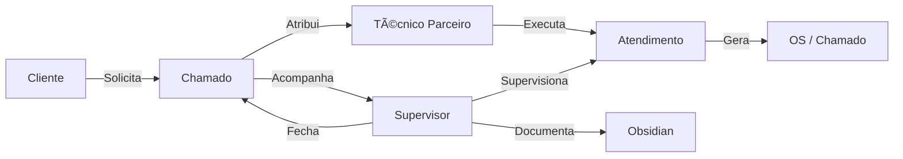

---
title: "Glossario Ilustrado"
description: "Diagramas Mermaid: ecossistema, arquitetura e fluxo de atendimento"
status: "novo"
---

# Glossário Ilustrado

> **Mapa visual de conceitos, atores e relacionamentos do sistema.**

---

## 1. Ecossistema de Atores

**Personagens:**
- **Cliente:** Quem solicita e recebe o atendimento.
- **Técnico Parceiro:** Profissional em campo que executa o serviço presencialmente.
- **Supervisor:** Você — responsável pelo acompanhamento remoto.

> Ver [[01-Fundacao/Personas.md|Personas]] e [[01-Fundacao/Glossario.md|Glossário]].

---

## 2. Visão Arquitetural Simplificada

```mermaid
graph TB
    subgraph Interface
        CLI["CLI (Typer + Rich)"]
        Hotkeys["Hotkeys Globais"]
    end
    subgraph Core
        Daemon["Daemon (Windows Service)"]
        EventBus["Event Bus"]
        Orquestrador
    end
    subgraph Agentes
        A01["A01 — Transcrição"]
        A02["A02 — Memória"]
        A03["A03 — Sugestão"]
    end
    subgraph Infraestrutura
        NamedPipe["Named Pipe (:8790)"]
        Postgres["PostgreSQL"]
        Redis["Redis"]
        Qdrant["Qdrant"]
        Obsidian
    end
    subgraph Externo
        Whisper["Whisper API"]
        Claude["Claude API"]
        Movidesk
    end

    CLI --> NamedPipe;
    Hotkeys --> Daemon;
    NamedPipe --> Daemon;
    Daemon --> EventBus;
    EventBus --> Orquestrador;
    Orquestrador --> A01;
    Orquestrador --> A02;
    Orquestrador --> A03;
    A01 --> Whisper;
    A01 --> Postgres;
    A02 --> Obsidian;
    A02 --> Qdrant;
    A03 --> Claude;
    A03 --> Redis;
    Daemon --> Movidesk;
```

> Ver [[04-Arquitetura/Arquitetura.md|Arquitetura]] e [[04-Arquitetura/Componentes.md|Componentes]].

---

## 3. Fluxo Simplificado de um Atendimento

```mermaid
sequenceDiagram
    participant C as Cliente
    participant S as Supervisor
    participant H as Hermes
    participant M as Movidesk
    participant O as Obsidian

    C->>S: Problema reportado
    S->>M: Abre chamado
    S->>H: inicia acompanhamento <id>
    Note over H: Grava áudio + Transcreve
    H->>S: Sugestões baseadas em histórico
    S->>C: Resolve problema (com técnico)
    S->>H: finalizar acompanhamento
    H->>S: Sugere resumo + e-mails
    S->>S: Aprova/edita
    H->>M: Atualiza OS
    H->>O: Salva notas
```

> Ver [[03-Comportamento/Fluxos.md|Fluxos]] e [[02-Requisitos/Casos-de-Uso.md|Casos de Uso]].

---

> [[00-Index/SDD-Index.md|Voltar ao índice]]

