---
title: "Fluxos"
description: "7 fluxos com diagramas Mermaid"
status: "concluido"
---

# Fluxos

> **Diagramas e descrições dos fluxos do sistema (normais e alternativos).**
> Todos os fluxos abaixo representam o comportamento esperado do sistema.
>
> Estes fluxos implementam os [[02-Requisitos/Casos-de-Uso.md|Casos de Uso]] do sistema.

---

## Fluxo 1 — Macro do Atendimento Completo

```mermaid
flowchart TD
    A[Cliente contata setor de atendimento] --> B[Setor abre chamado no Movidesk]
    B --> C[Setor contacta técnico parceiro]
    C --> D[Técnico parceiro vai ao local]
    D --> E[Você inicia acompanhamento remoto]
    E --> F[Execução do serviço]
    F --> G{Necessário áudio?}
    G -->|Sim| H[Ativa gravação de áudio]
    H --> I[Transcreve e resume]
    G -->|Não| I
    I --> J{Necessário registro de conhecimento?}
    J -->|Sim| K[Solicita registro no Obsidian]
    K --> L[Aprova/Altera e confirma]
    J -->|Não| L
    L --> M{Necessário e-mail?}
    M -->|Compra| N[Gera e-mail solicitação de compra]
    M -->|Comunicado| O[Gera e-mail de comunicado]
    M -->|Não| P
    N --> P
    O --> P
    P[Fechamento de OS]
    P --> Q{Técnico parceiro?}
    Q -->|Sim| R[Sugere status Retorno da OS + gera documento]
    Q -->|Não| S[Sugere status Resolvido]
    R --> T[Supervisor revisa e aprova]
    S --> T
    T --> U[Atualiza Movidesk]
    U --> V[Anexa documento assinado?]
    V -->|Sim| W[Atualiza status para Resolvido]
    V -->|Não| X[Aguardando documento]
    X --> V
```



> Este fluxo cobre os Casos de Uso [[02-Requisitos/Casos-de-Uso.md|UC-001 a UC-010]].

---

## Fluxo 2 — Gravação e Transcrição de Áudio

```mermaid
flowchart TD
    A[Acompanhamento ativo] --> B{Usuário aciona gravação?}
    B -->|Sim| C[Sistema pede confirmação]
    C --> D{Usuário confirma?}
    D -->|Sim| E[Inicia gravação]
    D -->|Não| F[Não grava]
    E --> G[Indicador visual ativo]
    G --> H{Usuário para gravação?}
    H -->|Sim| I[Para gravação]
    H -->|Não| G
    I --> J{Usuário solicita transcrição?}
    J -->|Sim| K[Envia áudio para Whisper]
    K --> L{Transcrição OK?}
    L -->|Sim| M[Processa com LLM]
    L -->|Não| N[Notifica erro]
    N --> O[Tenta novamente ou usa outro áudio]
    M --> P[Gera resumo estruturado]
    P --> Q[Exibe para revisão]
    Q --> R{Usuário aprova?}
    R -->|Sim| S[Resumo pronto para uso]
    R -->|Editar| T[Usuário edita]
    T --> S
    R -->|Regenerar| K
```



---

## Fluxo 3 — Registro de Conhecimento no Obsidian

```mermaid
flowchart TD
    A[Conteúdo gerado (resumo)] --> B{Usuário solicita registro?}
    B -->|Sim| C[Sistema analisa entidades]
    C --> D[Identifica: cliente, equipamentos, solução, procedimento]
    D --> E{Cliente já existe?}
    E -->|Sim| F[Sugere atualizar nota existente]
    E -->|Não| G[Sugere criar nova nota de cliente]
    F --> H
    G --> H{Equipamento já existe?}
    H -->|Sim| I[Sugere atualizar nota do equipamento]
    H -->|Não| J[Sugere criar nota do equipamento]
    I --> K
    J --> K{Solução já registrada?}
    K -->|Sim| L[Sugere vincular à solução existente]
    K -->|Não| M[Sugere criar nova nota de solução]
    L --> N
    M --> N[Sugere nota de atendimento com links]
    N --> O[Exibe prévia das alterações]
    O --> P{Usuário aprova?}
    P -->|Sim| Q[Cria/atualiza notas no Obsidian]
    Q --> R[Estabelece links entre notas]
    P -->|Editar| S[Usuário personaliza]
    S --> Q
    P -->|Rejeitar| T[Descarta alterações]
```

---

## Fluxo 4 — Fechamento de OS

```mermaid
flowchart TD
    A[Atendimento finalizado] --> B{Usuário solicita sugestão de fechamento?}
    B -->|Sim| C[Sistema consulta dados do chamado no Movidesk]
    C --> D[Monta prévia do fechamento]
    D --> E[Técnico parceiro em campo?]
    E -->|Sim| F[Sugere status: Retorno da OS]
    E -->|Não| G[Sugere status: Resolvido]
    F --> H[Inclui: aguardando documento assinado]
    H --> I[Sugere e-mail para técnico parceiro]
    G --> J[Inclui: resumo técnico, configs, equipamentos]
    I --> K
    J --> K[Exibe prévia para revisão]
    K --> L{Usuário aprova?}
    L -->|Sim| M{Status é Retorno da OS?}
    M -->|Sim| N[Atualiza Movidesk com Retorno da OS + gera doc]
    M -->|Não| O[Atualiza Movidesk com Resolvido]
    N --> P[Aguardando documento assinado]
    P --> Q{Documento recebido?}
    Q -->|Sim| R[Atualiza para Resolvido]
    Q -->|Não| P
    L -->|Editar| S[Usuário ajusta]
    S --> K
    L -->|Rejeitar| T[Cancela fechamento]
```



---

## Fluxo 5 — Geração de E-mail

```mermaid
flowchart TD
    A{Usuário solicita e-mail?} -->|Compra| B[Sistema pergunta materiais necessários]
    A -->|Comunicado| C[Sistema pergunta tipo: interno/externo]
    B --> D[Usuário informa materiais]
    D --> E[Sistema gera minuta]
    C --> F{Interno ou externo?}
    F -->|Interno| G[Sistema gera minuta tom informal]
    F -->|Externo| H[Sistema gera minuta tom formal]
    E --> I
    G --> I
    H --> I[Exibe minuta para revisão]
    I --> J{Usuário aprova?}
    J -->|Sim| K[Envia e-mail]
    J -->|Editar| L[Usuário edita]
    L --> I
    J -->|Rejeitar| M[Descarta e-mail]
    J -->|Rascunho| N[Salva como rascunho]
    K --> O[Registra no histórico]
    N --> O
```



---

## Fluxo 6 — Consulta de Histórico e Sugestão de Solução

```mermaid
flowchart TD
    A[Usuário pergunta ou pede sugestão] --> B[Sistema extrai contexto do atendimento]
    B --> C[Cliente, equipamento, sintomas]
    C --> D[Busca no banco vetorial]
    D --> E[Busca no Obsidian]
    E --> F{Encontrou casos similares?}
    F -->|Sim| G[Lista resultados por relevância]
    G --> H[Usuário seleciona um caso]
    H --> I[Exibe detalhes: solução, nota, histórico]
    F -->|Não| J[Informa: nenhum caso similar]
    J --> K[Sugere registrar como novo conhecimento]
    K --> L{Usuário quer registrar?}
    L -->|Sim| M[Fluxo de registro no Obsidian]
    L -->|Não| N[Encerra consulta]
```



---

## Fluxo 7 — Painel de Aprovações

```mermaid
flowchart TD
    A[Há ações pendentes] --> B[Sistema notifica usuário]
    B --> C[Usuário acessa painel]
    C --> D[Lista ações pendentes]
    D --> E[Para cada ação:]
    E --> F{Usuário decide}
    F -->|Aprovar| G[Sistema executa ação]
    F -->|Editar| H[Abre editor para ajustes]
    H --> G
    F -->|Rejeitar| I[Sistema descarta ação]
    F -->|Sonegar| J[Mantém pendente]
    G --> K[Registra em log]
    I --> K
    J --> D
    K --> L{Ainda há pendências?}
    L -->|Sim| D
    L -->|Não| M[Painel vazio]
```



---

**Premissas:**
- Todos os fluxos assumem que o Supervisor está logado e com acompanhamento ativo (quando aplicável).
- Fluxos alternativos podem ser adicionados conforme novos Casos de Uso forem identificados.

**Riscos:**
- Fluxos complexos podem ter variações não mapeadas — revisar com uso real.
- Dependência de serviços externos (Movidesk, e-mail, LLM) pode introduzir latência não prevista nos fluxos.

**Dúvidas em aberto:**
- Deve haver um fluxo específico para "Pausar e Retomar Acompanhamento"?
- Fluxo de "backup automático do vault Obsidian" deve ser mapeado?

**Próximos passos:**
- Identificar e documentar [[03-Comportamento/Riscos.md|Riscos]].
- Iniciar [[04-Arquitetura/Arquitetura.md|Arquitetura]] e [[04-Arquitetura/Componentes.md|Componentes]].

---
> [[00-Index/SDD-Index.md|Voltar ao índice]]

