---
title: "Agentes de IA"
description: "5 agentes de IA: Transcricao, Memoria, Documentacao, Comunicacao, Consulta"
status: "concluido"
---

# Agentes (IA)

> **Definição dos agentes de inteligência artificial, suas responsabilidades, interações e configurações.**
>
> Os agentes são coordenados pelo Hermes conforme definido na [[04-Arquitetura/ADRs.md|ADR-002]].

---

## Visão Geral

O sistema utiliza múltiplos agentes de IA especializados, coordenados pelo Hermes (orquestrador). Cada agente possui uma responsabilidade específica e utiliza o LLM + ferramentas apropriadas para sua função.

```mermaid
flowchart TD
    H[Hermes Orquestrador] --> A1[Agente de Transcrição]
    H --> A2[Agente de Memória]
    H --> A3[Agente de Documentação]
    H --> A4[Agente de Comunicação]
    H --> A5[Agente de Consulta]
    
    A1 --> W[Whisper]
    A1 --> L1[LLM - Extração]
    A2 --> L2[LLM - Classificação]
    A2 --> V[Banco Vetorial]
    A2 --> O[Obsidian]
    A3 --> L3[LLM - Geração]
    A3 --> M[Movidesk]
    A4 --> L4[LLM - Redação]
    A4 --> E[E-mail]
    A5 --> L5[LLM - Análise]
    A5 --> V
    A5 --> O
```



---

## A01 — Agente de Transcrição

**Responsabilidade:** Coordenar o processo de transcrição de áudio e extração de pontos-chave.

| Atributo | Descrição |
|----------|-----------|
| **Ativado por** | Comando do usuário ("transcrever", "resumir") |
| **Ferramentas** | Whisper (transcrição), LLM (extração de pontos-chave) |
| **Saída** | Resumo estruturado do atendimento |

### Fluxo de Trabalho

1. Recebe solicitação de transcrição do Hermes
2. Envia áudio para Whisper (local ou API)
3. Recebe transcrição em texto
4. Envia transcrição para LLM com prompt especializado:
   ```
   Extraia os seguintes pontos-chave deste atendimento técnico:
   - Problema relatado
   - Solução aplicada
   - Equipamentos envolvidos
   - Configurações realizadas
   - Observações relevantes
   
   Transcrição: [texto]
   ```
5. Estrutura o resultado em formato padronizado
6. Retorna ao Hermes para exibição e aprovação

### Prompt Especializado

```
Você é um assistente especializado em atendimentos técnicos.
Analise a transcrição fornecida e extraia APENAS as informações
solicitadas. Seja objetivo e técnico. Use termos padronizados.

Formato de saída (Markdown):
- Problema: [descrição concisa]
- Solução: [descrição concisa]
- Equipamentos: [lista separada por vírgulas]
- Configurações: [lista de configurações alteradas]
- Observações: [informações adicionais relevantes]
```

---

## A02 — Agente de Memória

**Responsabilidade:** Gerenciar o registro de conhecimento no Obsidian de forma organizada e estruturada.

| Atributo | Descrição |
|----------|-----------|
| **Ativado por** | Comando do usuário ("registrar no Obsidian", "salvar conhecimento") |
| **Ferramentas** | LLM (classificação e estruturação), Obsidian adapter, Banco Vetorial |
| **Saída** | Notas criadas/atualizadas no Obsidian |

### Fluxo de Trabalho

1. Recebe solicitação de registro + conteúdo do atendimento
2. Analisa o conteúdo e identifica entidades:
   - Cliente (nome, empresa, contato)
   - Equipamentos (tipo, modelo, configurações)
   - Procedimentos (passos executados)
   - Soluções (problema → solução)
3. Verifica no Obsidian se entidades já existem
4. Sugere estrutura de notas:
   - Se cliente novo: criar nota em `Clientes/{Cliente}.md`
   - Se cliente existente: atualizar nota com novo atendimento
   - Se equipamento novo: criar nota em `Equipamentos/{Tipo}/{Equipamento}.md`
   - Se solução recorrente: vincular à solução existente
5. Gera conteúdo das notas com links entre elas
6. Retorna prévia para aprovação do usuário
7. Após aprovação, executa a criação/atualização

### Regras de Estruturação

| Entidade | Pasta | Nome do Arquivo | Formato |
|----------|-------|-----------------|---------|
| Cliente | `Clientes/` | `Nome da Empresa.md` | Frontmatter + Histórico |
| Equipamento | `Equipamentos/{Tipo}/` | `Modelo.md` | Especificações + Atendimentos |
| Procedimento | `Procedimentos/` | `Nome do Procedimento.md` | Passos + Equipamentos |
| Solução | `Solucoes/` | `Problema - Solução.md` | Problema + Causa + Solução |
| Atendimento | `Atendimentos/{Ano}/` | `YYYY-MM-DD - Cliente - Resumo.md` | Resumo + Links |

> A estrutura do vault que este agente manipula está em [[05-Dados/Memoria-Obsidian.md]].

---

## A03 — Agente de Documentação (OS)

**Responsabilidade:** Sugerir o preenchimento do fechamento da Ordem de Serviço com base no resumo do atendimento.

| Atributo | Descrição |
|----------|-----------|
| **Ativado por** | Comando do usuário ("sugerir fechamento", "fechar OS") |
| **Ferramentas** | LLM (geração de resumo técnico), Movidesk adapter |
| **Saída** | Prévia de fechamento de OS para aprovação |

### Fluxo de Trabalho

1. Recebe solicitação + resumo do atendimento + dados do chamado
2. Verifica no chamado se há técnico parceiro associado
3. Gera conteúdo para campos do Movidesk:
   - **Resumo técnico:** Texto descritivo do serviço executado
   - **Configurações realizadas:** Lista de alterações
   - **Equipamentos trocados:** Lista com modelos e quantidades
   - **Hora/data:** Preenchido automaticamente
4. Determina status adequado:
   - Com técnico parceiro → "Retorno da OS"
   - Sem técnico parceiro → "Resolvido"
5. Retorna prévia completa para revisão do usuário
6. Após aprovação, envia ao Movidesk

### Prompt Especializado

```
Com base no resumo do atendimento técnico abaixo, gere o conteúdo
para o fechamento de uma Ordem de Serviço no Movidesk.

Seja técnico e objetivo. Inclua apenas informações relevantes.

Resumo: [resumo]

Campos a preencher:
1. Resumo Técnico (2-3 parágrafos)
2. Configurações Realizadas (lista)
3. Equipamentos Envolvidos/Trocados (lista)
```

---

## A04 — Agente de Comunicação

**Responsabilidade:** Gerar minutas de e-mail (solicitação de compra e comunicados) com base no contexto do atendimento.

| Atributo | Descrição |
|----------|-----------|
| **Ativado por** | Comando do usuário ("gerar e-mail de compra", "gerar comunicado") |
| **Ferramentas** | LLM (redação), E-mail adapter |
| **Saída** | Minuta de e-mail para revisão |

### Fluxo de Trabalho

**E-mail de Solicitação de Compra:**
1. Pergunta ao usuário quais materiais são necessários (ou infere do contexto)
2. Gera minuta com: descritivo do material, justificativa, dados do cliente
3. Usa template: Solicitação de Compra - {Cliente} - {Material}
4. Retorna minuta para revisão

**E-mail de Comunicado:**
1. Pergunta o tipo: interno (equipe) ou externo (cliente)
2. Gera minuta com tom apropriado:
   - Interno: informal, direto
   - Externo: formal, educado
3. Inclui resumo do atendimento
4. Retorna minuta para revisão

### Templates Base

**Solicitação de Compra:**
```
Assunto: Solicitação de Compra - {Cliente} - {Material}

Prezados,

Solicito a compra do(s) seguinte(s) material(is) para atendimento
ao cliente {Cliente}:

{Lista de materiais}

Justificativa: {Justificativa}

Atenciosamente,
{Nome}
```

**Comunicado Externo:**
```
Assunto: {Assunto} - {Cliente}

Prezado(a) {Cliente},

Informamos que o atendimento referente a {Assunto} foi realizado.
{Resumo do atendimento}

Segue em anexo a documentação do serviço.

Atenciosamente,
{Equipe}
```

---

## A05 — Agente de Consulta

**Responsabilidade:** Responder perguntas do usuário com base na base de conhecimento e sugerir soluções com base em casos anteriores.

| Atributo | Descrição |
|----------|-----------|
| **Ativado por** | Pergunta do usuário em linguagem natural ou comando de sugestão |
| **Ferramentas** | LLM (análise e compreensão), Banco Vetorial, Obsidian adapter |
| **Saída** | Resposta contextualizada com fontes |

### Fluxo de Trabalho

1. Recebe pergunta do usuário (ex.: "Qual a senha padrão do equipamento X?", "Já vimos esse problema antes?")
2. Extrai termos de busca da pergunta
3. Consulta banco vetorial (Qdrant) por similaridade semântica
4. Consulta Obsidian por matching de tags e palavras-chave
5. Combina resultados e ranqueia por relevância
6. Envia contexto + pergunta para LLM gerar resposta
7. Retorna resposta com indicação das fontes (links para notas do Obsidian)

### Exemplos de Perguntas

| Pergunta | Ação |
|----------|------|
| "Qual a senha do roteador do cliente X?" | Busca equipamento → senha no Obsidian |
| "Já resolvemos esse problema antes?" | Busca similaridade semântica no banco vetorial |
| "Qual procedimento para instalação do equipamento Y?" | Busca procedimento no Obsidian |
| "Quando foi o último atendimento do cliente Z?" | Busca histórico do cliente |

---

## Matriz de Agentes vs LLM Usage

| Agente | Tarefa | Modelo Recomendado | Custo Relativo |
|--------|--------|-------------------|:--------------:|
| A01 — Transcrição | Extração de pontos-chave | Haiku / 4o-mini | Baixo |
| A02 — Memória | Classificação e estruturação | Sonnet / 4o | Médio |
| A03 — Documentação | Geração de resumo técnico | Sonnet / 4o | Médio |
| A04 — Comunicação | Redação de e-mails | Haiku / 4o-mini | Baixo |
| A05 — Consulta | Análise e resposta | Sonnet / 4o | Médio |

---

## Orquestração pelo Hermes

O Hermes coordena os agentes da seguinte forma:

1. **Recebe comando do usuário** (via CLI)
2. **Interpreta a intenção** (qual agente acionar)
3. **Aciona o agente** com contexto necessário
4. **Aguarda resultado** ou **executa em background** (com notificação)
5. **Apresenta resultado** para revisão do usuário
6. **Aguarda aprovação** antes de executar ações externas
7. **Executa e registra** após aprovação

### Exemplo de Fluxo Completo

```
Usuário: "iniciar acompanhamento 12345"
→ Hermes: Aciona Acompanhamento → consulta Movidesk → cria sessão

Usuário: "gravar" (hotkey)
→ Hermes: Pede confirmação → inicia gravação

Usuário: "parar"
→ Hermes: Para gravação → salva áudio

Usuário: "transcrever"
→ Hermes: Aciona A01 (Transcrição) → envia áudio → recebe resumo → exibe

Usuário: "salvar conhecimento"
→ Hermes: Aciona A02 (Memória) → analisa conteúdo → sugere notas → exibe prévia

Usuário: "aprovar tudo"
→ Hermes: Executa todas as ações aprovadas → Obsidian: criar notas
                                                      → A03: gerar fechamento
                                                      → exibe prévia fechamento

Usuário: "fechar OS"
→ Hermes: Envia fechamento para Movidesk → registra em log
```

---

**Premissas:**
- Cada agente utiliza o LLM via a mesma interface (ILLM), com prompts especializados.
- Agentes podem ser refinados, fundidos ou divididos conforme necessidade.

**Riscos:**
- Agentes dependentes de LLM podem gerar respostas inconsistentes se os prompts não forem bem calibrados.
- Custo de LLM pode aumentar com uso frequente de modelos mais caros (A03, A05).

**Dúvidas em aberto:**
- Os agentes devem ter "personalidade" ou tom específico?
- Deve haver logging separado por agente para debugging?

**Próximos passos:**
- Detalhar Banco de Dados e Memória (Obsidian).

---
> [[00-Index/SDD-Index.md|Voltar ao índice]]

