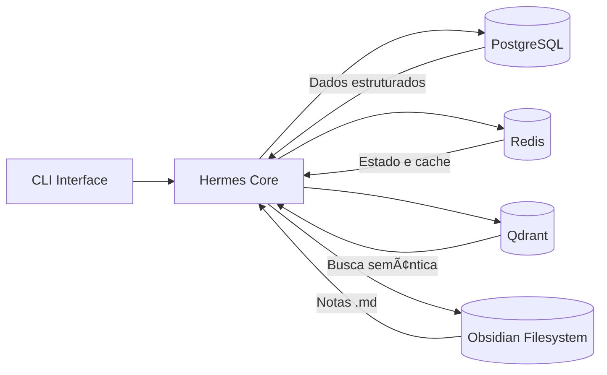

---
title: "Banco de Dados"
description: "PostgreSQL (DDL), Redis (cache/sessao), Qdrant (vetorial)"
status: "concluido"
---

# Banco de Dados

> **Modelagem de dados, esquemas e tecnologias de armazenamento.**
>
> As decisões sobre banco vetorial (Qdrant) estão na [[04-Arquitetura/ADRs.md|ADR-004]]. O Event Bus está na [[04-Arquitetura/ADRs.md|ADR-011]].

---

## Visão Geral

O sistema utiliza três tipos de armazenamento:

| Tipo | Tecnologia | Finalidade | Referência |
|------|------------|------------|------------|
| **Relacional** | PostgreSQL | Dados estruturados do sistema (sessões, logs, config) | — |
| **Cache / Estado** | Redis | Sessões ativas, cache de consultas, fila de aprovações | — |
| **Vetorial** | Qdrant | Busca semântica | Ver [[04-Arquitetura/ADRs.md\|ADR-004]] |
| **Arquivos** | Filesystem (Obsidian vault) | Conhecimento persistente em .md | — |

---

## 1. PostgreSQL — Modelo Relacional

### Entidades

```mermaid
erDiagram
    SESSION ||--o{ AUDIO_LOG : contains
    SESSION ||--o{ ACTION_LOG : contains
    SESSION ||--o{ PENDING_ACTION : contains
    SESSION {
        uuid id PK
        string ticket_id "ID do chamado no Movidesk"
        string client_name
        string client_company
        string technician "Técnico parceiro"
        string status "active | paused | completed"
        string type "Tipo de atendimento"
        timestamp started_at
        timestamp ended_at
        jsonb metadata "Dados extras"
    }
    
    AUDIO_LOG {
        uuid id PK
        uuid session_id FK
        string file_path "Caminho do arquivo"
        int duration_seconds
        timestamp started_at
        timestamp ended_at
        string status "recorded | transcribed | processed"
    }
    
    ACTION_LOG {
        uuid id PK
        uuid session_id FK
        string action_type "transcription | knowledge | email | os | approval"
        string action "Criar nota, enviar e-mail, etc."
        string status "pending | approved | rejected | executed"
        timestamp created_at
        timestamp decided_at
        string user_decision "approved | edited | rejected | snoozed"
        jsonb details "Detalhes da ação"
        jsonb previous_hash "Hash do log anterior (audit chain)"
    }
    
    PENDING_ACTION {
        uuid id PK
        uuid session_id FK
        string action_type
        string title "Título para exibição"
        text preview "Prévia do conteúdo"
        jsonb action_data "Dados completos para execução"
        string urgency "low | medium | high"
        timestamp created_at
    }
    
    CONFIG {
        string key PK
        text value
        string description
        timestamp updated_at
    }
    
    CACHE_CLIENT {
        string client_id PK
        string name
        string company
        jsonb contacts
        timestamp last_synced
    }
```



### SQL (DDL)

```sql
-- Sessões de acompanhamento
CREATE TABLE sessions (
    id UUID PRIMARY KEY DEFAULT gen_random_uuid(),
    ticket_id VARCHAR(50),
    client_name VARCHAR(255) NOT NULL,
    client_company VARCHAR(255),
    technician VARCHAR(255),
    status VARCHAR(20) NOT NULL DEFAULT 'active'
        CHECK (status IN ('active', 'paused', 'completed', 'cancelled')),
    type VARCHAR(50),
    started_at TIMESTAMP NOT NULL DEFAULT NOW(),
    ended_at TIMESTAMP,
    metadata JSONB DEFAULT '{}'
);

CREATE INDEX idx_sessions_status ON sessions(status);
CREATE INDEX idx_sessions_ticket ON sessions(ticket_id);
CREATE INDEX idx_sessions_started ON sessions(started_at);

-- Logs de áudio
CREATE TABLE audio_logs (
    id UUID PRIMARY KEY DEFAULT gen_random_uuid(),
    session_id UUID NOT NULL REFERENCES sessions(id),
    file_path TEXT NOT NULL,
    duration_seconds INT,
    started_at TIMESTAMP NOT NULL,
    ended_at TIMESTAMP,
    status VARCHAR(20) NOT NULL DEFAULT 'recorded'
        CHECK (status IN ('recorded', 'transcribed', 'processed', 'deleted'))
);

-- Logs de auditoria (append-only)
CREATE TABLE action_logs (
    id UUID PRIMARY KEY DEFAULT gen_random_uuid(),
    session_id UUID NOT NULL REFERENCES sessions(id),
    action_type VARCHAR(30) NOT NULL,
    action VARCHAR(100) NOT NULL,
    status VARCHAR(20) NOT NULL DEFAULT 'pending'
        CHECK (status IN ('pending', 'approved', 'rejected', 'executed')),
    created_at TIMESTAMP NOT NULL DEFAULT NOW(),
    decided_at TIMESTAMP,
    user_decision VARCHAR(20)
        CHECK (user_decision IN ('approved', 'edited', 'rejected', 'snoozed')),
    details JSONB DEFAULT '{}',
    previous_hash VARCHAR(64) -- SHA-256 do log anterior (cadeia)
);

CREATE INDEX idx_action_logs_session ON action_logs(session_id);
CREATE INDEX idx_action_logs_status ON action_logs(status);

-- Ações pendentes de aprovação
CREATE TABLE pending_actions (
    id UUID PRIMARY KEY DEFAULT gen_random_uuid(),
    session_id UUID NOT NULL REFERENCES sessions(id),
    action_type VARCHAR(30) NOT NULL,
    title VARCHAR(255) NOT NULL,
    preview TEXT,
    action_data JSONB NOT NULL,
    urgency VARCHAR(10) NOT NULL DEFAULT 'medium'
        CHECK (urgency IN ('low', 'medium', 'high')),
    created_at TIMESTAMP NOT NULL DEFAULT NOW()
);

CREATE INDEX idx_pending_actions_urgency ON pending_actions(urgency);

-- Configurações do sistema
CREATE TABLE config (
    key VARCHAR(100) PRIMARY KEY,
    value TEXT NOT NULL,
    description TEXT,
    updated_at TIMESTAMP NOT NULL DEFAULT NOW()
);

-- Cache de clientes (dados do Movidesk)
CREATE TABLE client_cache (
    client_id VARCHAR(50) PRIMARY KEY,
    name VARCHAR(255) NOT NULL,
    company VARCHAR(255),
    contacts JSONB DEFAULT '{}',
    last_synced TIMESTAMP NOT NULL DEFAULT NOW()
);
```

---

## 2. Redis — Cache e Estado

### Estruturas Utilizadas

| Chave | Tipo | TTL | Descrição |
|-------|------|:---:|-----------|
| `session:{id}` | Hash | — | Estado da sessão ativa |
| `session:{id}:audio` | String | 1h | Caminho do áudio atual |
| `session:{id}:context` | Hash | — | Contexto do atendimento |
| `pending_count` | String | — | Número de ações pendentes |
| `cache:movidesk:{ticket_id}` | String | 30min | Cache de consulta ao Movidesk |
| `cache:llm:{prompt_hash}` | String | 1h | Cache de respostas do LLM |
| `auth:token` | String | — | Token de autenticação (futuro) |

### Exemplo de Sessão Ativa (Hash)

```
session:SES-001:
  - ticket_id: "12345"
  - client: "Empresa ABC"
  - status: "active"
  - recording: "true"
  - started_at: "2026-07-02T12:00:00Z"
  - technicians: "Carlos (Técnico Parceiro)"
```

---

## 3. Qdrant — Banco Vetorial

### Collections

```json
{
  "collections": [
    {
      "name": "notas_obsidian",
      "vectors": {
        "size": 1536,
        "distance": "Cosine"
      },
      "payload_schema": {
        "note_path": "keyword",
        "note_type": "keyword",
        "client": "keyword",
        "tags": "keyword",
        "created_at": "datetime",
        "updated_at": "datetime"
      }
    },
    {
      "name": "atendimentos",
      "vectors": {
        "size": 1536,
        "distance": "Cosine"
      },
      "payload_schema": {
        "session_id": "keyword",
        "ticket_id": "keyword",
        "client": "keyword",
        "problem_type": "keyword",
        "date": "datetime",
        "resolution": "text"
      }
    }
  ]
}
```

### Sincronização

- **Trigger:** Alteração no vault do Obsidian (watcher) OU comando manual
- **Processo:** Ler nota → gerar embedding via API de embeddings (Ada-002 ou similar) → upsert no Qdrant
- **Frequência:** Automática (near-real-time) ou sob demanda

---

## 4. Filesystem — Obsidian Vault

Ver [[05-Dados/Memoria-Obsidian.md]] para detalhes completos.

---

## 5. Fluxo de Dados entre Armazenamentos



## 6. Backup e Manutenção

| Banco | Backup | Frequência | Retenção |
|-------|--------|------------|----------|
| PostgreSQL | pg_dump | Diário | 30 dias |
| Redis | RDB / AOF | — | Dados voláteis |
| Qdrant | Snapshot | Diário | 30 dias |
| Obsidian | Git / Cópia | A cada alteração | Indeterminado |

---

**Premissas:**
- O modelo pode evoluir conforme novos requisitos surgirem.
- A estrutura do banco relacional é enxuta para o MVP.

**Riscos:**
- Sincronização entre Obsidian e Qdrant pode ser complexa.
- Backup do Obsidian via git pode ser problemático se o vault for muito grande.

**Dúvidas em aberto:**
- Necessário particionamento no PostgreSQL no futuro?
- O Redis pode ser substituído por SQLite + cache em memória para simplificar o MVP?

**Próximos passos:**
- Detalhar estrutura da Memória no Obsidian.

---
> [[00-Index/SDD-Index.md|Voltar ao índice]]

