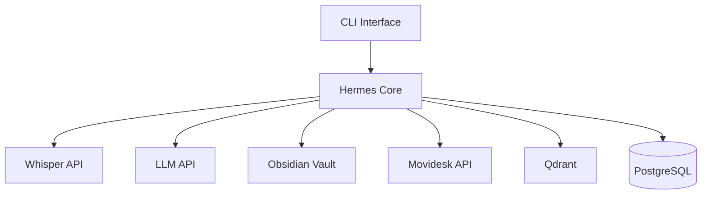

---
title: "MVP"
description: "Escopo do MVP: criterios, funcionalidades, estimativa e entregaveis"
status: "concluido"
---

# MVP

> **Escopo mínimo viável para a primeira entrega do sistema.**
> O MVP deve entregar valor real (redução de tempo burocrático) com o mínimo de complexidade.

---

## Critérios para Inclusão no MVP

1. **Valor percebido:** Resolve uma dor real do dia a dia.
2. **Viabilidade técnica:** Pode ser implementado em tempo razoável.
3. **Independência:** Não depende de funcionalidades ainda não implementadas.
4. **Testabilidade:** Pode ser testado e validado rapidamente.

---

## Escopo do MVP

> As funcionalidades listadas são detalhadas em [[02-Requisitos/Requisitos-Funcionais.md]] e priorizadas no [[06-Planejamento/Backlog.md]].

### O Que Entra

| # | Funcionalidade | RFs | Agente | Dependências |
|---|---------------|-----|--------|:------------:|
| 1 | **CLI Básica** — Comandos essenciais (iniciar sessão, gravar áudio, transcrever, registrar) | RF-ACOMP-001, RF-ACOMP-002, RF-UI-001, RF-UI-002, RF-UI-003 | — | — |
| 2 | **Gravação de Áudio** — Iniciar/parar com confirmação e indicador visual | RF-AUDIO-001 a 005 | — | Hardware áudio |
| 3 | **Transcrição e Resumo** — Transcrever áudio e extrair pontos-chave | RF-TRANS-001 a 004 | A01 — Transcrição | Whisper (API) |
| 4 | **Registro no Obsidian** — Salvar conhecimento estruturado com aprovação | RF-MEM-001 a 004 | A02 — Memória | Obsidian vault |
| 5 | **Sugestão de Fechamento de OS** — Gerar resumo técnico para Movidesk | RF-OS-001, RF-OS-002, RF-OS-003 | A03 — Documentação | Movidesk API |
| 6 | **Sugestão de E-mail (Compra/Comunicado)** — Gerar minutas para aprovação | RF-EMAIL-001 a 003 | A04 — Comunicação | — |
| 7 | **Painel de Aprovações** — Revisar e aprovar/rejeitar ações pendentes | RF-SEG-001, RF-SEG-004, RF-UI-003 | — | — |
| 8 | **Log de Auditoria** — Registro de todas as ações | RF-SEG-003 | — | PostgreSQL |
| 9 | **Banco Vetorial (Qdrant)** — Indexação e busca semântica básica | RF-CONSULTA-002, RF-IA-001 | A05 — Consulta | Qdrant |
| 10 | **Integração com Movidesk** — Consultar e atualizar chamados | RF-INT-001, RF-OS-005 | — | [[04-Arquitetura/Movidesk-API.md\|Movidesk API]] |

### O Que NÃO Entra no MVP

| Funcionalidade | Motivo |
|----------------|--------|
| Integração com n8n | Complexidade adicional; automações podem ser implementadas diretamente no Hermes no MVP |
| Interface Web | CLI é suficiente para o usuário técnico; web adiciona complexidade |
| Múltiplos LLM providers | Um provider (ex.: Claude) é suficiente; fallback pode vir depois |
| Backup automático do Obsidian | Pode ser manual via git no início |
| Interface para Técnico Parceiro | Escopo de uso individual |
| Dashboard de métricas | Pode vir depois com dados reais |
| Suporte offline completo | MVP depende de internet para LLM; funcionalidades locais continuam |
| Personalização de templates de e-mail | Templates fixos no MVP, customização depois |
| Upload de fotos/vídeos | MVP foca em áudio e texto; mídia visual depois |

---

## Arquitetura Simplificada do MVP

### Componentes do MVP vs Pós-MVP

| Componente | MVP | Pós-MVP |
|------------|:---:|:-------:|
| CLI Interface | ✅ | ✅ |
| Core Engine | ✅ | ✅ |
| Audio Recorder | ✅ | ✅ |
| Transcriber (Whisper API) | ✅ (API) | ✅ + Local |
| LLM Client | ✅ (1 provider) | ✅ (múltiplos) |
| Memory Manager (Obsidian) | ✅ | ✅ |
| Movidesk Client | ✅ | ✅ |
| Email Service | ✅ (SMTP direto) | ✅ + n8n |
| Vector Store (Qdrant) | ✅ (básico) | ✅ + refinamento |
| PostgreSQL | ✅ (essencial) | ✅ + manutenção |
| Redis | ❌ (opcional) | ✅ |
| n8n Integration | ❌ | ✅ |
| Banco Vetorial avançado | ❌ | ✅ |
| Interface Web | ❌ | ✅ |

---

## Estimativa de Esforço do MVP

| Funcionalidade | Estimativa | Depende de |
|----------------|:----------:|:----------:|
| 1 — CLI Básica | 5 dias | — |
| 2 — Gravação de Áudio | 3 dias | CLI |
| 3 — Transcrição e Resumo | 5 dias | Gravação, LLM |
| 4 — Registro no Obsidian | 4 dias | Transcrição |
| 5 — Sugestão Fechamento OS | 3 dias | Transcrição, LLM |
| 6 — Sugestão E-mail | 2 dias | LLM |
| 7 — Painel de Aprovações | 3 dias | CLI |
| 8 — Log de Auditoria | 2 dias | — |
| 9 — Banco Vetorial | 4 dias | Obsidian |
| 10 — Integração Movidesk | 3 dias | — |
| **Total (estimativa)** | **~34 dias úteis** | ~7 semanas |

> **Nota:** Estimativas consideram desenvolvimento em tempo parcial. Refinar com POC de cada tecnologia.

---

## Critérios de Aceitação do MVP

| Critério | Métrica |
|----------|---------|
| Fluxo completo funcional | Conseguir: iniciar sessão → gravar áudio → transcrever → registrar no Obsidian → sugerir fechamento de OS |
| Redução de tempo em burocracia | Redução de pelo menos 30% no tempo de fechamento de OS |
| Nenhuma ação automática | Zero ações executadas sem aprovação do usuário |
| Estabilidade | Sistema não crasha durante uso normal |

---

## Entregáveis do MVP

1. Código-fonte funcional do Hermes (core + CLI)
2. Vault do Obsidian estruturado com modelos
3. Documentação de uso do sistema
4. Script de setup (instalação de dependências, configuração)

---

**Premissas:**
- O MVP será iterativo: funcionalidades podem ser entregues em ondas dentro do MVP.
- O usuário participará ativamente da validação de cada funcionalidade.

**Riscos:**
- Dependência de API do Movidesk pode atrasar a funcionalidade de fechamento de OS.
- Qualidade da transcrição pode não atender às expectativas iniciais.

**Dúvidas em aberto:**
- Deve ser criada uma POC (prova de conceito) para validar a integração com Movidesk antes de iniciar o MVP?
- A estimativa de 34 dias é realista para desenvolvimento em paralelo com o trabalho?

**Próximos passos:**
- Detalhar Backlog priorizado.
- Criar Roadmap.

---
> [[00-Index/SDD-Index.md|Voltar ao índice]]

