---
title: "Roadmap"
description: "4 ondas (10 semanas) + Pos-MVP com marcos e timeline"
status: "concluido"
---

# Roadmap

> **Cronograma macro de entregas e marcos do projeto.**
>
> Este roadmap organiza as entregas do [[06-Planejamento/Backlog.md|Backlog]] e define os marcos do [[06-Planejamento/MVP.md|MVP]].
> O progresso é acompanhado pelo [[06-Planejamento/Checklist-MVP.md|Checklist MVP]].

---

## Visão Geral

```mermaid
gantt
    title Roadmap Hermes + Obsidian
    dateFormat  YYYY-MM-DD
    
    section Sprint 0 - Fundação
    Setup repositório/ambiente (B-001 a B-006) :2026-07-06, 5d
    CI básico (B-007)                         :2026-07-06, 5d
    
    section MVP - Onda 1 (Semanas 2-4)
    CLI estrutura/comandos (B-008 a B-010)    :crit, 2026-07-13, 10d
    Gravação de áudio (B-011 a B-014)         :2026-07-20, 5d
    Hotkeys + status (B-015 a B-017)          :2026-07-27, 3d
    
    section MVP - Onda 2 (Semanas 4-7)
    Whisper + LLM (B-018 a B-022)             :crit, 2026-07-27, 10d
    Registro Obsidian (B-027 a B-036)         :2026-08-03, 10d
    Revisão/tratamento erros (B-023 a B-026)  :2026-08-10, 5d
    
    section MVP - Onda 3 (Semanas 7-9)
    Integração Movidesk (B-037)               :crit, 2026-08-10, 5d
    Fechamento de OS (B-038 a B-042)          :2026-08-17, 10d
    Geração de e-mail (B-043 a B-047)         :2026-08-17, 5d
    
    section MVP - Onda 4 (Semanas 9-11)
    Aprovações e controle (B-048 a B-052)     :2026-08-24, 5d
    Busca semântica (B-053 a B-058)           :2026-08-24, 10d
    Testes e validação final                  :2026-09-01, 5d
    
    section Pós-MVP (Epics 7-10)
    Epic 7 - Estabilidade (B-059 a B-065)     :2026-09-08, 15d
    Epic 8 - n8n (B-066 a B-070)              :2026-09-22, 10d
    Epic 9 - Web (B-071 a B-074)              :2026-10-06, 20d
    Epic 10 - Avançado (B-075 a B-082)        :2026-10-20, 30d
```



> **Legenda:** `crit` = item no caminho crítico (atraso aqui desliza o projeto)

---

## Caminho Crítico

As entregas abaixo estão no caminho crítico — qualquer atraso desliza o cronograma:

```
B-008 (CLI estrutura)  →  B-011 (gravação)  →  B-018 (Whisper)
                                                     ↓
B-037 (Movidesk API)   →  B-038 (fechamento OS)   B-020 (LLM)
                                                     ↓
                                              B-027 (Obsidian)
                                                     ↓
                                              B-053 (Qdrant)
```

| Entrega | Bloqueia | Se atrasar |
|---------|----------|------------|
| B-008 a B-010 — CLI estrutura | Toda Onda 1 e 2 | +1 semana por item |
| B-018 — Integração Whisper | B-019 a B-026 (transcrição) | +2 dias |
| B-020 — Integração LLM | B-021 a B-026, B-038, B-043 | +3 dias |
| B-037 — Integração Movidesk | B-038 a B-042 (fechamento) | +3-5 dias |
| B-027 — Integração Obsidian | B-028 a B-036, B-053 | +2 dias |

> Para detalhes de cada item, consulte [[06-Planejamento/Backlog.md]].

---

## Marcos (Milestones)

| Marco | Data | Status | Checklist | Entregas |
|-------|:----:|:------:|:---------:|----------|
| **M1 — Setup Completo** | 10/07/2026 | 🔴 | — | B-001 a B-007: repositório, ambiente, Docker, vault, estrutura de dados, CI |
| **M2 — Gravação Funcional** | 24/07/2026 | 🔴 | Func. 1-2 | B-008 a B-017: CLI operacional, comandos iniciar/finalizar, gravação com confirmação, indicador visual, hotkeys |
| **M3 — Transcrição e Resumo** | 07/08/2026 | 🔴 | Func. 3 | B-018 a B-022, B-025: Whisper API, LLM, transcrição, resumo estruturado |
| **M4 — Memória no Obsidian** | 14/08/2026 | 🔴 | Func. 5 | B-027 a B-036: integração vault, análise de entidades, notas com template e links, aprovação |
| **M5 — Fechamento de OS** | 21/08/2026 | 🔴 | Func. 8 | B-037 a B-042: integração Movidesk, sugestão de fechamento, gestão de status, envio |
| **M6 — Geração de E-mail** | 28/08/2026 | 🔴 | Func. 9 | B-043 a B-047: minutas de e-mail (compra e comunicado), envio com aprovação |
| **M7 — Busca Semântica** | 04/09/2026 | 🔴 | Func. 6 | B-053 a B-058: indexação Qdrant, busca, histórico, ranqueamento |
| **M8 — MVP Completo** | 11/09/2026 | 🔴 | Func. 1-10 | Sistema funcional ponta a ponta: M1 a M7 integrados, validação com uso real |
| **M9 — Estabilização** | 25/09/2026 | 🔴 | — | B-059 a B-065: Redis, fallback Whisper local, testes, backup, criptografia |
| **M10 — Automações** | 06/10/2026 | 🔴 | — | B-066 a B-070: n8n configurado, workflows de integração |
| **M11 — Interface Web** | 30/10/2026 | 🔴 | — | B-071 a B-074: API REST, Web App básico |
| **M12 — Features Avançadas** | 30/11/2026 | 🔴 | — | B-075 a B-082: sugestão proativa, dashboard, app técnico (parcial) |

> **Status:** 🔴 não iniciado | 🟡 em andamento | 🟢 concluído

---

## Ondas de Entrega

### Onda 1 — Fundação e Áudio (Semanas 1-3, 06/07 a 26/07)
**Foco:** CLI básica funcional e gravação de áudio com segurança

**Itens do Backlog:** B-001 a B-017

| Semana | Período | Sprint | Entregas |
|--------|---------|--------|----------|
| Semana 1 | 06-10/07 | Sprint 0 | B-001 a B-007: repositório, ambiente Python, Docker (Postgres + Qdrant), vault Obsidian, estrutura de dados, CI básico |
| Semana 2 | 13-17/07 | Sprint 1 | B-008 a B-010: CLI com Typer, comandos `iniciar`, `finalizar`, `status` |
| Semana 3 | 20-24/07 | Sprint 2 | B-011 a B-017: gravação com confirmação, indicador visual, hotkey Ctrl+Shift+R, pausa/retorno |

**Dependências:** Nenhuma externa. Hardware de áudio necessário.

---

### Onda 2 — IA e Memória (Semanas 4-6, 27/07 a 16/08)
**Foco:** Transcrição, resumo e registro de conhecimento no Obsidian

**Itens do Backlog:** B-018 a B-036

| Semana | Período | Sprint | Entregas |
|--------|---------|--------|----------|
| Semana 4 | 27-31/07 | Sprint 3 | B-018 a B-022: integração Whisper API, LLM, comando `transcrever`, `resumir`, resumo estruturado |
| Semana 5 | 03-07/08 | Sprint 4 | B-027 a B-033: integração vault, análise de entidades, criação de notas com template, links |
| Semana 6 | 10-14/08 | Sprint 5 | B-023 a B-026, B-034 a B-036: tratamento de erros, cache LLM, aprovação/edição, templates de nota |

**Dependências:** Chaves de API (Whisper, Anthropic). Onda 1 completa (CLI + gravação).

> Nota: B-024 (transcrição parcial) e B-026 (cache LLM) são P2 — podem ser diferidos se o tempo apertar.

---

### Onda 3 — Documentação e Integrações (Semanas 7-9, 17/08 a 06/09)
**Foco:** Fechamento de OS, e-mails, integração com Movidesk

**Itens do Backlog:** B-037 a B-047

| Semana | Período | Sprint | Entregas |
|--------|---------|--------|----------|
| Semana 7 | 17-21/08 | Sprint 6 | B-037: POC + integração API Movidesk (consulta de chamados). **Item crítico.** |
| Semana 8 | 24-28/08 | Sprint 7 | B-038 a B-042, B-047: sugestão de fechamento, resumo técnico, definição de status, envio |
| Semana 9 | 31/08-04/09 | Sprint 8 | B-043 a B-046: geração de e-mail (compra + comunicado), templates, rascunho |

**Dependências:** Token de API do Movidesk. Onda 2 completa (transcrição + Obsidian).

> **Risco:** Se a API do Movidesk for complexa, B-037 pode consumir toda a Semana 7. Buffer de 2 dias alocado.

---

### Onda 4 — Finalização do MVP (Semanas 10-11, 07/09 a 19/09)
**Foco:** Aprovações, busca, testes e ajustes finais

**Itens do Backlog:** B-048 a B-058

| Semana | Período | Sprint | Entregas |
|--------|---------|--------|----------|
| Semana 10 | 07-11/09 | Sprint 9 | B-048 a B-052: fila de aprovações, comandos `pendentes`, `aprovar`, `editar`, `rejeitar`, log de auditoria |
| Semana 11 | 14-18/09 | Sprint 10 | B-053 a B-058: indexação Qdrant, comando `buscar`, `historico`, ranqueamento. Testes de integração |

**Dependências:** Ondas 1-3 completas. Qdrant rodando.

---

### Pós-MVP (Semanas 12+, 21/09 em diante)

**Itens do Backlog:** B-059 a B-082

| Período | Epic | Itens | Entregas |
|---------|:----:|:-----:|----------|
| Semanas 12-14 (21/09 a 11/10) | **Epic 7 — Estabilidade** | B-059 a B-065 | Redis, fallback Whisper local, múltiplos providers LLM, testes automatizados, backup, criptografia |
| Semanas 15-16 (12/10 a 25/10) | **Epic 8 — n8n** | B-066 a B-070 | Setup n8n, workflows de e-mail, Movidesk, backup, webhook |
| Semanas 17-20 (26/10 a 22/11) | **Epic 9 — Web** | B-071 a B-074 | API REST FastAPI, Web App básico, notificações WebSocket, upload mídia |
| Semanas 21-25 (23/11 a 27/12) | **Epic 10 — Avançado** | B-075 a B-082 | Sugestão proativa, grafo de conhecimento, dashboard, multi-usuário, app técnico, WhatsApp, calendário, exportação |

---

## Riscos do Cronograma

| Risco | Impacto | Probabilidade | Mitigação |
|-------|:-------:|:-------------:|-----------|
| Complexidade da API do Movidesk subestimada | Atraso na Onda 3 | Média | POC dedicada na Semana 7; buffer de 2 dias alocado |
| Qualidade do Whisper abaixo do esperado | Retrabalho na Onda 2 | Média | Testar com amostras reais na Semana 4; fallback Whisper local no Pós-MVP |
| Dependência de LLM (custo/disponibilidade) | Atraso geral | Baixa | Ter chave reserva; cache de respostas (B-026) |
| Escopo maior que o estimado | Atraso geral | Alta | Revisão semanal; cortar itens P1 se necessário |
| Disponibilidade reduzida do usuário para validação | Atraso em todas as ondas | Média | Validações assíncronas sempre que possível |
| Problemas de ambiente (Windows Service, Named Pipe) | Atraso na Onda 1 | Baixa | POC do Named Pipe antes do Sprint 1 |

---

## Premissas

- **Dedicação:** Desenvolvimento contínuo em tempo parcial (~20h/semana), sem pausas planejadas entre ondas.
- **Deadline:** Sem data fixa. O MVP será considerado pronto quando passar nos [[06-Planejamento/Checklist-MVP.md|c critérios do Checklist MVP]].
- **Validação:** O usuário valida cada funcionalidade dentro da semana de entrega.
- **Dependências externas:** Chaves de API (Whisper, LLM, Movidesk) disponíveis antes do início de cada onda.
- **Feriados:** Sem feriados relevantes no período. Se houver, o cronograma desliza proporcionalmente.
- **Refinamento:** As estimativas serão ajustadas conforme o progresso real. Este roadmap é um guia, não uma promessa.

---

## Registro de Ajustes

| Data | Ajuste | Motivo |
|------|--------|--------|
| — | — | — |

---

> [[00-Index/SDD-Index.md|Voltar ao índice]]

